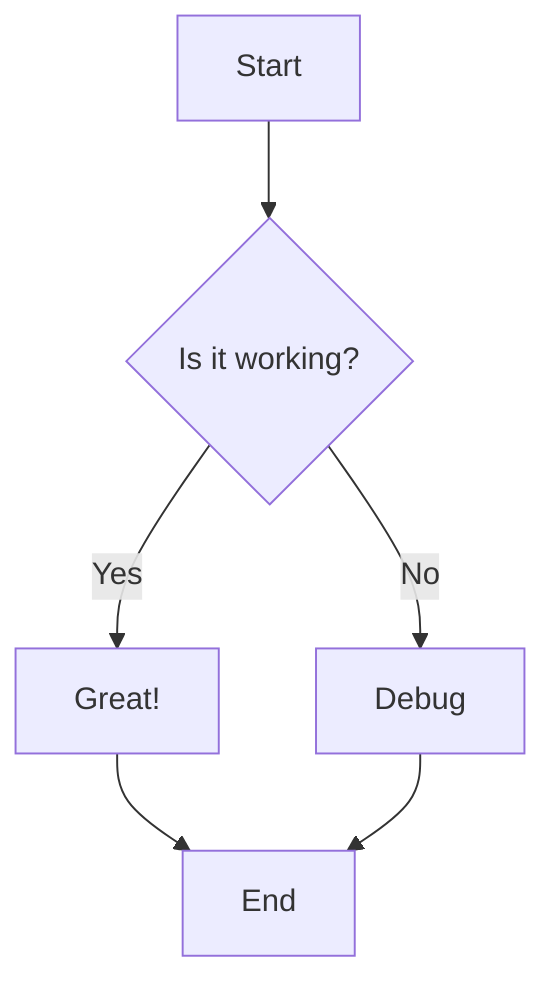
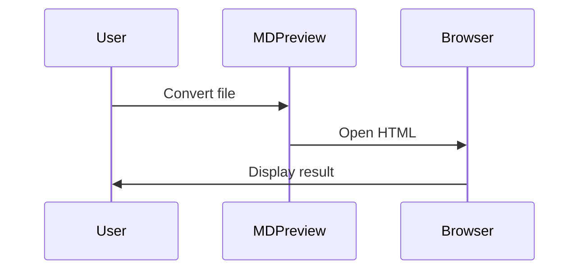

# MDPreview

A fast, lightweight CLI tool for converting Markdown to HTML and opening it in your browser with intelligent caching. Powered by Bun for fast performance.

## Features

- ✅ **GitHub-like styling** with automatic dark mode support
- ✅ **Light/dark mode override** via `-l`/`-d` flags
- ✅ **Lightning-fast** with Bun runtime and intelligent caching using SHA256 hashes
- ✅ **Local image support** with automatic copying to cache
- ✅ **Mermaid diagrams** with interactive toggle between diagram and source code
- ✅ **Syntax highlighting** for 100+ programming languages
- ✅ **Multiple files** — open several markdown files at once
- ✅ **Multiple browser support** (Firefox, Chrome, Safari)
- ✅ **Markdown extensions** (GitHub Flavored Markdown, tables, fenced code, etc.)
- ✅ **Configurable page width** for better display of wide content

## Quick Start

```bash
# Basic usage (opens in Firefox by default)
./mdpreview document.md

# Multiple files
./mdpreview doc1.md doc2.md doc3.md

# Browser shortcuts
./mdpreview document.md -g    # Chrome
./mdpreview document.md -s    # Safari
./mdpreview document.md -f    # Firefox

# Theme control
./mdpreview document.md -l    # Force light mode
./mdpreview document.md -d    # Force dark mode
                              # (default: follows system preference)

# Width control for wide content
./mdpreview document.md -w 1200    # Wide layout (1200px)
./mdpreview document.md -w 600     # Narrow layout (600px)

# Cache control
./mdpreview document.md -N         # Skip cache, force regeneration
./mdpreview -X                     # Clean cache directory
```

### mdp — Interactive Launcher

The `mdp` script wraps `mdpreview` with an `fzf` file picker for fast interactive use:

```bash
# Pick a markdown file from the current directory
mdp

# Pick from a specific directory
mdp ~/docs

# Open a file directly (skips fzf)
mdp README.md

# Pass options through to mdpreview
mdp -d README.md    # dark mode
mdp -w 1200         # wide layout
```

`mdp` defaults to Chrome and light mode. Add it to your `PATH` by symlinking:

```bash
ln -s /path/to/mdpreview/mdp ~/.local/bin/mdp
```

## Use Case

MDPreview provides an extremely fast and simple way to view markdown files in your browser with professional GitHub-like styling. Perfect for quickly previewing documentation, notes, or README files without the overhead of a full markdown editor.

With intelligent content-based caching, subsequent views of the same file are nearly instantaneous (<100ms). The cache automatically invalidates when you edit the markdown file, ensuring you always see the latest version.

## Image Support

MDPreview automatically handles images in your markdown files:

- **Local images** are copied to the cache directory alongside the HTML
- **Remote images** (http/https URLs) work without any changes
- **Relative paths** are resolved based on the markdown file location
- **Supported formats**: PNG, JPG, JPEG, GIF, SVG, WebP

### How It Works

When you preview a markdown file containing local images, MDPreview:
1. Detects all local image references
2. Copies them to a subdirectory in the cache (`{hash}_images/`)
3. Updates the HTML to reference the cached copies
4. Preserves the cache for fast subsequent views

### Example: Image Syntax

| Markdown Source | Rendered Output |
|----------------|-----------------|
| `` |  |
| `` |  |
| `` |  |

## Mermaid Diagram Support

MDPreview includes full support for Mermaid diagrams with an interactive toggle feature:

- **All diagram types supported**: flowcharts, sequence diagrams, Gantt charts, class diagrams, etc.
- **Interactive toggle button**: Switch between rendered diagram and source code
- **Automatic rendering**: Diagrams render on page load
- **GitHub-style buttons**: Consistent with the overall design

### Example: Mermaid Diagrams

**Flowchart Syntax:**
````markdown

````

**Rendered Flowchart:**


---

**Sequence Diagram Syntax:**
````markdown

````

**Rendered Sequence Diagram:**


## Installation

### Prerequisites

- **Bun** runtime (https://bun.sh)
- **Supported platforms**: macOS (ARM64/Intel), Linux (x64/ARM64), Windows (x64)
- **Modern web browser** (Firefox, Chrome, or Safari)
- **fzf** (optional, for the `mdp` interactive launcher)

### Option 1: Install from Source

```bash
# Clone the repository
git clone https://github.com/thejud/mdpreview.git
cd mdpreview

# Install dependencies
bun install

# Run directly
bun run src/cli.ts document.md

# Or use the mdp launcher (add to PATH)
ln -s "$PWD/mdp" ~/.local/bin/mdp
```

### Option 2: Build Standalone Executable

```bash
# Build for your current platform (defaults to macOS ARM64)
bun run build

# This creates a standalone binary: ./mdpreview
./mdpreview document.md

# Move to your PATH for system-wide access
sudo mv mdpreview /usr/local/bin/
```

#### Cross-Platform Builds

Build standalone executables for multiple platforms:

```bash
# Build for specific platforms
bun run build:macos-arm64      # macOS Apple Silicon (M1/M2/M3)
bun run build:macos-x64        # macOS Intel
bun run build:linux-x64        # Linux x64
bun run build:linux-arm64      # Linux ARM64
bun run build:windows-x64      # Windows x64

# Build for all platforms at once
bun run build:all

# Outputs to dist/ directory:
# - dist/mdpreview-macos-arm64
# - dist/mdpreview-macos-x64
# - dist/mdpreview-linux-x64
# - dist/mdpreview-linux-arm64
# - dist/mdpreview-windows-x64.exe
```

**Note:** You can cross-compile from any platform to any other platform.

## Usage

```
Usage: mdpreview [options] <markdown_file> [markdown_file2] [...]

Options:
  -h, --help            Show this help message
  -b, --browser BROWSER Browser to open with (e.g., "Google Chrome", "Safari")
  -g, --chrome          Open with Google Chrome
  -s, --safari          Open with Safari
  -f, --firefox         Open with Firefox (default)
  -l, --light           Force light mode theme
  -d, --dark            Force dark mode theme
  -w, --width WIDTH     Maximum width for content in pixels (default: 980)
  -N, --no-cache        Skip cache and regenerate HTML
  -X, --clean-cache     Clean the cache directory

Examples:
  mdpreview README.md                    # Open in Firefox (default, auto theme)
  mdpreview foo.md bar.md                # Open multiple files
  mdpreview document.md -g               # Open in Google Chrome
  mdpreview document.md -l               # Force light mode
  mdpreview document.md -d               # Force dark mode
  mdpreview wide-content.md -w 1200      # Custom width
  mdpreview document.md -N               # Skip cache
  mdpreview -X                           # Clean all cache
```

## Caching

MDPreview uses intelligent content-based caching:

- **SHA256 hash** of file content determines cache key
- **Cache directory**: `/tmp/mdpreview/`
- **Cache invalidation**: Automatic when file content changes
- **Performance**: <100ms for cached files, <500ms for fresh conversion

Cache structure:
```
/tmp/mdpreview/
├── {hash1}.html
├── {hash1}_images/
│   ├── diagram.png
│   └── screenshot.jpg
├── {hash2}.html
└── {hash2}_images/
    └── logo.svg
```

## Testing

The project includes comprehensive test coverage with unit, integration, and E2E tests:

```bash
# Run all tests
bun test

# Run specific test file
bun test tests/unit/hash.test.ts

# Run E2E visual tests (uses Playwright)
bun test tests/e2e/visual.test.ts
```

## Project Structure

```
mdpreview/
├── src/
│   ├── cli.ts                    # Main CLI entry point
│   ├── core/
│   │   ├── hash.ts               # SHA256 content hashing
│   │   ├── cache.ts              # Cache management
│   │   └── markdown.ts           # Markdown processing
│   ├── processors/
│   │   ├── images.ts             # Local image processor
│   │   └── mermaid.ts            # Mermaid diagram processor
│   ├── rendering/
│   │   ├── styles.ts             # GitHub-like CSS
│   │   └── template.ts           # HTML template generation
│   └── browser/
│       └── launcher.ts           # Browser launch logic
├── tests/
│   ├── unit/                     # Unit tests
│   ├── integration/              # Integration tests
│   └── e2e/                      # End-to-end tests (Playwright)
├── mdp                           # Interactive fzf launcher
├── package.json
└── tsconfig.json
```

## Technical Details

- **Runtime**: Bun (fast JavaScript/TypeScript runtime)
- **Markdown Parser**: marked with GitHub Flavored Markdown support
- **Syntax Highlighting**: highlight.js (100+ languages)
- **Mermaid**: mermaid.js via CDN
- **Testing**: Bun's built-in test runner + Playwright for E2E
- **Type Safety**: TypeScript strict mode

## Limitations

- **Local files only** — Cannot fetch remote markdown files
- **Static preview** — No live reload on file changes
- **Browser launching** — Primarily tested on macOS (uses `open` command); may need adjustment on Linux/Windows

## Version History

- **v3.0.0** — Light/dark mode flags (`-l`/`-d`), multiple file support, self-locating `mdp` script, cross-platform builds
- **v2.0.0** — Complete rewrite in Bun/TypeScript with TDD, added Mermaid support
- **v1.0.0** — Original Python implementation

---

Made with ❤️ for the markdown community
