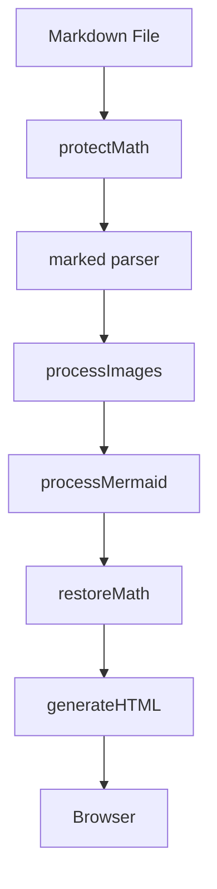
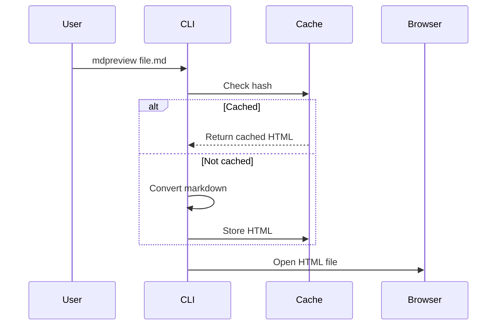

# MDPreview Features Showcase

This document demonstrates all supported features.

---

## Text Formatting

Regular text with **bold**, *italic*, ~~strikethrough~~, and `inline code`.

> Blockquotes are supported too.

## Links

- [External link](https://example.com)
- Autolink: https://example.com

## Lists

### Ordered

1. First item
2. Second item
3. Third item

### Unordered

- Item A
- Item B
  - Nested item

### Task List

- [x] Completed task
- [ ] Pending task

## Tables

| Feature | Status | Notes |
|---------|--------|-------|
| Markdown | Supported | GitHub Flavored |
| Math | Supported | MathJax v3 |
| Mermaid | Supported | All diagram types |
| Images | Supported | Local + remote |

## Syntax Highlighting

### Python

```python
def fibonacci(n: int) -> list[int]:
    """Generate Fibonacci sequence."""
    fib = [0, 1]
    for i in range(2, n):
        fib.append(fib[-1] + fib[-2])
    return fib

print(fibonacci(10))
```

### TypeScript

```typescript
interface Config {
  theme: 'light' | 'dark' | 'auto';
  width: number;
}

function render(config: Config): string {
  return `<div style="max-width: ${config.width}px">Hello</div>`;
}
```

### Shell

```bash
# Convert and preview a markdown file
mdpreview README.md -l -w 1200
```

## Math Expressions

### Inline Math

The quadratic formula gives $x = \frac{-b \pm \sqrt{b^2 - 4ac}}{2a}$ as the solution.

Einstein's famous equation: $E = mc^2$.

Euler's identity: $e^{i\pi} + 1 = 0$.

### Display Math

The Gaussian integral:

$$\int_{-\infty}^{\infty} e^{-x^2} dx = \sqrt{\pi}$$

Maxwell's equations in differential form:

$$\nabla \cdot \mathbf{E} = \frac{\rho}{\varepsilon_0}$$

$$\nabla \cdot \mathbf{B} = 0$$

$$\nabla \times \mathbf{E} = -\frac{\partial \mathbf{B}}{\partial t}$$

$$\nabla \times \mathbf{B} = \mu_0 \mathbf{J} + \mu_0 \varepsilon_0 \frac{\partial \mathbf{E}}{\partial t}$$

A matrix:

$$\begin{pmatrix} a & b \\ c & d \end{pmatrix} \begin{pmatrix} x \\ y \end{pmatrix} = \begin{pmatrix} ax + by \\ cx + dy \end{pmatrix}$$

### Math with Subscripts/Superscripts

The sum $\sum_{i=1}^{n} x_i$ should render correctly — underscores in math are not treated as markdown emphasis.

Taylor series: $f(x) = \sum_{n=0}^{\infty} \frac{f^{(n)}(a)}{n!}(x-a)^n$

### Dollar Signs in Code (Not Math)

Inline code with dollars: `$PATH` and `$HOME` are not math.

```bash
echo $PATH
price="\$9.99"
```

### Escaped Dollar Signs

A literal \$5 bill is not math.

## Mermaid Diagrams

### Flowchart



### Sequence Diagram



## Images

### Markdown Syntax (Local)


### Multiple Formats

| Format | Image |
|--------|-------|
| PNG |  |
| JPG |  |
| SVG |  |
| GIF |  |

### Remote Images


---

*Generated by MDPreview*
