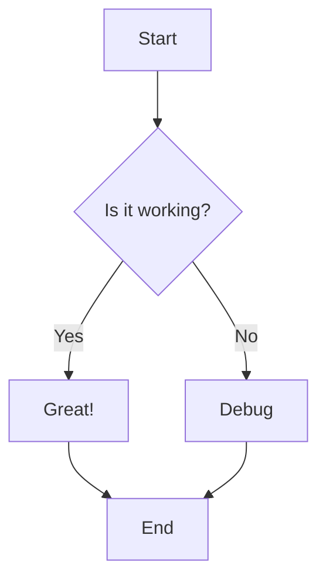
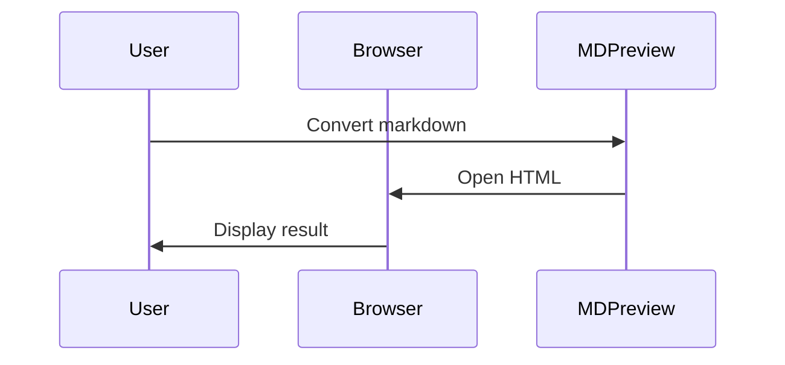

# Visual Features Test

## Local Images

Here's a local test image:


## Remote Images

Remote image from placeholder service:


## Mermaid Diagram



## Another Mermaid



## Mixed Content

This tests both **images** and *mermaid diagrams* together.


## Code Block (Not Mermaid)

```python
def hello():
    print("This should NOT be a mermaid diagram")
```
